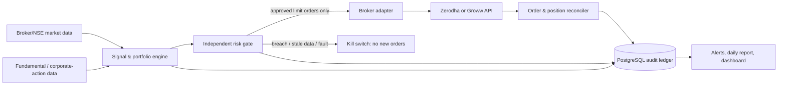

# NSE Automated Investing Bot — Project Plan

**Prepared:** 31 July 2026  
**Scope:** A personal, production-quality system that analyses the Indian/NSE market and places trades in the owner's existing broker account. It is not a public trading product, investment-advisory service, or high-frequency-trading system.

## Executive recommendation

Start with a **long-only, cash-equity/ETF, low-turnover systematic investing bot**. Keep strategy/research logic in a small custom service, but outsource broker connectivity, market data, custody, risk checks, and—if daily hands-free operation is essential—execution hosting to a broker-supported, NSE-empanelled algo provider.

Use **one broker as the production execution broker**, not both. The recommended initial technical route is Zerodha + Kite Connect because it offers free order/account APIs and a ₹500/month data plan. Groww is a viable alternative at ₹499/month plus taxes. Do not split the same strategy across both brokers until reconciliation and tax reporting are mature.

There is one material limitation: the retail API paths documented by both brokers use daily-expiring tokens and a daily user authorisation/approval process. The agreed operating model is therefore **minimal-touch**: the owner completes the supported daily authorisation/readiness check, while all analysis, risk checks, execution, reconciliation, reporting and alerts run automatically. Never bypass or script 2FA/TOTP contrary to the broker's terms.

This plan deliberately excludes F&O, leverage, intraday scalping, market orders, and ML/LLM-driven discretionary execution in its first release. Those features add material tail, liquidity, operational, and regulatory risk before a reliable base system exists.

### Daily owner interaction (target: under two minutes)

1. The bot sends a pre-market readiness link/alert and remains in **paused** state.
2. The owner completes the broker's official login/approval flow; the callback exchanges and stores the daily session securely.
3. The bot checks session validity, whitelisted IP, cash/margins, market calendar, time synchronisation and last reconciliation, then sends a single **ready** or **blocked** alert.
4. If it is not ready by the configured cut-off, it places no new orders. No spreadsheet upload, order entry, signal approval or end-of-day reconciliation is required from the owner in the normal path.

## 1. Regulatory and operating guardrails (non-negotiable)

1. Trade only the owner's own account. Do not sell signals, execute for other people, pool funds, or claim/advertise returns. Those activities can trigger additional SEBI registration and compliance obligations.
2. Treat every API order as algorithmic. The NSE retail-algo standard requires static-IP mapping, authentication safeguards, algo tagging and auditability. For client-developed algos, the initial threshold is 10 orders/second per exchange/segment; higher speeds require registration through the broker.
3. Use the static IPv4 address of the production VM/VPS and whitelist it at the broker. Do not use a residential dynamic address.
4. Use only limit and stop-limit orders in v1. Market orders are not permitted through algo trading under the current NSE retail-algo FAQ; keeping IOC out of the design is safer as well.
5. Persist an immutable decision/order/audit log. NSE requires brokers to retain the relevant audit trail for at least five years; retaining the bot's own event history is necessary for reconciliation and investigation.
6. Reconfirm the broker's current API/risk policy and NSE rules before go-live. Rules and API capabilities change.

## 2. Target operating model

The risk gate must be technically independent from the strategy code: an excellent signal is still blocked if price data is stale, buying power is insufficient, a limit would be breached, a duplicate order is detected, or broker/position state cannot be reconciled.

## 3. Technology plan

| Layer                 | Chosen technology                                                                                                                                                                         | Why / standard                                                                                                                        |
| --------------------- | ----------------------------------------------------------------------------------------------------------------------------------------------------------------------------------------- | ------------------------------------------------------------------------------------------------------------------------------------- |
| Strategy and services | Node.js 22 LTS, TypeScript, Fastify, Zod and typed domain models                                                                                                                          | One strongly typed language for the API, scheduler, strategy, risk and broker adapters; runtime validation prevents malformed orders. |
| Broker interface      | Adapter interface; initial `KiteAdapter`, optional `GrowwAdapter`                                                                                                                         | Prevents broker APIs leaking into strategy logic and makes broker migration/test doubles possible.                                    |
| Data and audit ledger | PostgreSQL, Prisma ORM and version-controlled migrations                                                                                                                                  | ACID transactions, queryable history, schema migration discipline.                                                                    |
| Scheduling / work     | `pg-boss` (PostgreSQL-backed jobs) or a small TypeScript worker; cron only launches the worker                                                                                            | Deterministic trading-calendar jobs, retries, idempotency and explicit run state without a fragile collection of cron scripts.        |
| Research/backtest     | TypeScript strategy simulator using `decimal.js` for money and a custom cost/slippage model; optional offline Python research notebook only if a future quantitative requirement needs it | Keeps the money-moving system in one language while avoiding floating-point errors and backtest/live divergence.                      |
| Deployment            | Docker Compose on a Linux VM with a reserved/static public IPv4; AWS Lightsail 2 GB is sufficient for v1                                                                                  | Stable egress IP fulfils the broker whitelist requirement and isolates credentials from a personal laptop.                            |
| Security              | Cloud secret manager or encrypted host secrets; least-privilege SSH; encrypted backups; dependency pinning/SBOM                                                                           | Never store API secrets, access tokens or TOTP seeds in source code, `.env` files committed to Git, chat logs, or a dashboard.        |
| Monitoring            | Structured JSON logs, health checks, Sentry/OpenTelemetry-compatible error reporting, uptime monitor, Telegram/email alerts                                                               | A bot that is silent during a failed order is unsafe.                                                                                 |
| CI/CD                 | GitHub repository, GitHub Actions, pnpm, ESLint, Prettier, TypeScript strict mode, Vitest, dependency/container vulnerability scans                                                       | Automated quality gates before any production deployment.                                                                             |

No microservices or Kubernetes in v1. A modular monolith on one static-IP VM is easier to audit, operate and recover. Add a warm standby only after the paper-trading run proves that availability is a real bottleneck.

## 4. What to outsource vs. build

| Capability                                                           | Decision                                                                                                                             | Reason                                                                                                                                        |
| -------------------------------------------------------------------- | ------------------------------------------------------------------------------------------------------------------------------------ | --------------------------------------------------------------------------------------------------------------------------------------------- |
| Order routing, exchange membership, RMS, custody and contract notes  | Outsource to the broker                                                                                                              | Never build or emulate broker/exchange functions.                                                                                             |
| Live market data and broker instrument master                        | Use the selected broker API initially                                                                                                | Lower cost and less vendor risk for a low-frequency personal bot.                                                                             |
| Fully hands-free hosted execution                                    | Outsource if it is a hard requirement                                                                                                | Choose only a current NSE-empanelled algo provider that is commercially/technically supported by the chosen broker. Get written confirmation. |
| Portfolio signal, risk budget, allocation rules and decision records | Build / own                                                                                                                          | This is the differentiated logic and is what needs transparent testing.                                                                       |
| Corporate actions / fundamentals                                     | Start with a reviewed source and manual data-quality checks; contract a licensed source before relying on it for automated decisions | Scraped data can be incomplete, delayed or non-licensed.                                                                                      |
| Observability, backups, source control, alerts                       | Managed cloud/SaaS where practical                                                                                                   | Commodity services reduce operational risk.                                                                                                   |

### Vendor due-diligence checklist

Before contracting an automation platform, verify all of the following in writing:

- The provider appears on NSE's **current** empanelled-algo-provider list, the algo type is suitable (white-box is preferred for a personal investor), and the provider is supported by the exact broker selected.
- The broker hosts/originates orders in the manner currently required by NSE; get the static-IP, tagging, registration and authentication workflow.
- The provider is not asking for the broker password, PIN, raw TOTP secret or an unencrypted access token.
- The subscription covers the exact segments, order types, data, audit exports, kill switch, SLAs, data ownership, incident notification and termination/export process needed.
- Backtest results include brokerage, STT, exchange transaction charges, GST, stamp duty, slippage, impact, corporate actions and delisted/survivorship-biased instruments. No vendor return claim is sufficient evidence.

NSE's maintained provider list is the starting point, not an endorsement of a vendor or a guarantee that it integrates with every broker.

## 5. Implementation roadmap and acceptance gates

| Phase                                           | Work                                                                                                                                                                                                                                                                    | Exit / no-go evidence                                                                                                                                                     | Reference                                                                                                                                                                                                            |
| ----------------------------------------------- | ----------------------------------------------------------------------------------------------------------------------------------------------------------------------------------------------------------------------------------------------------------------------- | ------------------------------------------------------------------------------------------------------------------------------------------------------------------------- | -------------------------------------------------------------------------------------------------------------------------------------------------------------------------------------------------------------------- |
| 0 — Charter and broker validation (week 1)      | Define owner, investment objective, holding horizon, allowed instruments, tax entity, loss capacity, max capital and hard limits. Ask Zerodha and Groww which retail-algo path supports the selected architecture. Select one execution broker.                         | Written risk policy; broker's written answer on static IP, tagging and daily authentication; no credentials shared.                                                       | [NSE retail algo standards](https://nsearchives.nseindia.com/content/circulars/INVG67858.pdf), [NSE provider list](https://www.nseindia.com/static/trade/empanelled-algo-providers-exchange)                         |
| 1 — Strategy specification (weeks 1–2)          | Start with a rules-based, long-only portfolio: a defined universe of liquid NSE ETFs and/or liquid cash equities, fixed rebalance schedule, explicit entry/exit rules, allocation method and benchmark. Write a one-page strategy spec and risk limits before coding.   | Every decision is reproducible from a versioned config. No neural network/news/LLM is allowed to submit an order.                                                         | [SEBI retail-algo circular](https://www.sebi.gov.in/legal/circulars/feb-2025/safer-participation-of-retail-investors-in-algorithmic-trading_91614.html)                                                              |
| 2 — Research and data validation (weeks 2–5)    | Build reproducible data ingest, clean/adjust prices, model a realistic execution delay and costs, then run walk-forward and out-of-sample testing across bull, bear and stressed periods. Add unit tests for indicators, corporate-action handling and position sizing. | Results survive out-of-sample periods and realistic costs; no look-ahead, survivorship, selection or delisting bias; written research report.                             | [Zerodha historical/live data plan](https://support.zerodha.com/category/trading-and-markets/general-kite/kite-api/articles/what-are-the-charges-for-kite-apis) / [Groww API data scope](https://groww.in/trade-api) |
| 3 — Execution and controls (weeks 4–7)          | Implement broker adapter, static-IP deployment, idempotent order submission, order state machine, reconciliation, retries with backoff, audit ledger, kill switch, notifications, backup/restore and secret rotation.                                                   | Fault-injection tests show: duplicate submission cannot overbuy; broker timeouts recover safely; stale price/cash/position states block orders; a restart resumes safely. | [Zerodha static-IP requirement](https://support.zerodha.com/category/trading-and-markets/general-kite/kite-api/articles/static-ip), [Groww API rate limits/auth](https://groww.in/trade-api/docs/curl)               |
| 4 — Paper/shadow operation (minimum 8–12 weeks) | Run scheduled signals and a simulated execution ledger during live market hours. Reconcile against live quotes and expected broker behaviour each day; perform a disaster-recovery rehearsal.                                                                           | Zero unexplained position/order mismatches, all alerts delivered, cost/slippage model is calibrated, recovery objective demonstrated.                                     | [Kite session documentation](https://kite.trade/docs/connect/v3/user/)                                                                                                                                               |
| 5 — Controlled production (at least 4 weeks)    | Release at a small, pre-approved fraction of capital; one strategy and one rebalance cadence. Compare actual fills/costs to model daily.                                                                                                                                | Increase capital only after the risk owner signs an evidence-based release review. Any control breach returns to shadow mode.                                             | [Zerodha charges](https://zerodha.com/charges/), [Groww charges](https://groww.in/pricing/futures-and-options)                                                                                                       |
| 6 — Operations and review (ongoing)             | Daily automated report; monthly strategy, cost, dependency, security and regulatory review; quarterly restore test; change approval for every strategy/config update.                                                                                                   | Auditable records, tested backups, patched dependencies and a confirmed kill-switch procedure.                                                                            | [NSE retail-algo FAQ](https://nsearchives.nseindia.com/web/sites/default/files/inline-files/FAQ_Retail%20Algo_03112025_NSE.pdf)                                                                                      |

### Required release controls

- **Capital and concentration:** policy-defined maximum single position, sector exposure, daily purchase amount, gross exposure and minimum cash reserve. Initial values must be chosen by the account owner, not optimised from a backtest.
- **Loss and anomaly guard:** block new orders after a daily loss, repeated rejected orders, data staleness, abnormal spread, failed reconciliation, broker outage or unexpected position.
- **Execution controls:** deterministic client-order ID, price collar, size/notional limit, limit/stop-limit orders only, no averaging down, no infinite retry, no unbounded loop.
- **Human emergency control:** a local/phone-accessible kill switch disables new entries immediately; exit treatment must be pre-specified because automated liquidation can be harmful in a disorderly market.
- **Change control:** Git pull request, tests, review, strategy/config version, paper/shadow validation and a cooling period before a material rule change reaches production.

## 6. Your Zerodha and Groww accounts

Yes—both accounts can be used, but one should be the initial production broker.

### Zerodha

- Kite Connect's personal tier provides order, GTT, account and margin APIs at no charge. The Connect plan is ₹500/month per app and adds real-time WebSocket data and historical candles.
- Zerodha requires a static IP for API order placement from 1 April 2026. Its access token expires at 6 AM the next day as a regulatory requirement, so design a secure daily authorisation step or obtain a broker-supported hosted path; do not attempt to defeat the flow.
- It is the preferred fit for this in-house, low-frequency system because daily authorisation is acceptable.

### Groww

- Groww's trading API is ₹499/month plus taxes and covers live data, historical data, orders, portfolio and margin; it supports NSE/BSE cash and F&O, but not MCX through this API.
- Its documented access token also expires daily; API-key/secret and TOTP approaches still require daily approval on the Groww Cloud API-keys page. This is not a reliable basis for a completely unattended personal system unless Groww provides a supported alternative in writing.
- Evaluate it as a second adapter only after the Zerodha implementation has proven its reconciliation and control model. Do not use two brokers merely to increase trade frequency.

## 7. Monthly cost model (INR)

All figures below are planning estimates as of 31 July 2026, exclude investment capital and one-time development, and can change with broker, cloud, FX and taxes. Use the official price pages when purchasing. Transaction costs scale with turnover and are _not_ a fixed operating expense.

### Recommended in-house v1 — one broker, low-frequency delivery/ETF strategy

| Item                           |                    Monthly estimate | Notes                                                                                                                                               |
| ------------------------------ | ----------------------------------: | --------------------------------------------------------------------------------------------------------------------------------------------------- |
| Zerodha Connect data API       |             ₹500 + GST (about ₹590) | ₹0 if using only the Personal order/account APIs and no live/historical data from Kite.                                                             |
| **or** Groww API               |             ₹499 + GST (about ₹589) | Alternative; do not buy both in v1.                                                                                                                 |
| Linux VM with public IPv4      |                 about ₹1,000–₹1,200 | AWS Lightsail's 2 GB public-IPv4 bundle is currently US$12/month; a smaller VM may be inadequate once PostgreSQL, logs and monitoring are included. |
| Backups, monitoring and alerts |                           ₹200–₹800 | Can begin near zero with free tiers, but budget for encrypted backups and alerting.                                                                 |
| Licensed supplemental data     | ₹0 initially; quote before purchase | Required only when the model relies on data the broker does not licence/provide reliably.                                                           |
| **Fixed operating total**      |       **about ₹1,800–₹2,600/month** | One broker/API, one VM, basic backup/monitoring; before cloud taxes and FX variation.                                                               |

### Production-resilient option

Budget **₹3,500–₹6,500/month** for a primary VM plus a warm standby/independent backup path, managed monitoring and larger log retention. This is appropriate only after the v1 controls are proven; a warm standby must have an approved static-IP/failover process because changing the broker whitelist is limited.

### Variable costs — budget separately

- Broker/exchange/tax/DP charges are tied to turnover and trade type. At Zerodha, equity delivery has zero brokerage, but STT, exchange charges, GST, stamp duty and DP charges still apply. Intraday/F&O adds brokerage (e.g., up to ₹20 per executed order at Zerodha) and materially different statutory charges.
- Account fees, data vendor fees, strategy-provider fees and any exchange registration/hosting fees are extra.
- For a broker-hosted, NSE-empanelled vendor solution, request a written quote; subscription, broker linkage and strategy scope differ too much to state an industry-standard fixed price responsibly. Compare its all-in fee to the in-house fixed cost **and** verify that it solves the daily-authorisation issue.

## 8. Useful plugins, integrations and packages

### Codex/project plugins (not required for trading execution)

| Plugin                                         | Use                                                                                    | Priority            |
| ---------------------------------------------- | -------------------------------------------------------------------------------------- | ------------------- |
| GitHub                                         | Repository, protected pull requests, issues, Actions CI, Dependabot/security workflows | Recommended         |
| Slack **or** Teams                             | Production alert channel and incident acknowledgement                                  | Optional but useful |
| Atlassian Rovo **or** Notion                   | Requirements, runbooks, decision log and release evidence                              | Optional            |
| Figma, Box, SharePoint, Outlook Calendar/Email | No core execution need                                                                 | Not required        |

Only install GitHub/Slack/Teams/Notion connectors if those are already approved tools in the organisation. A trading bot must still work safely if every third-party connector is unavailable.

### Application dependencies

- Broker SDK/API: official Kite Connect JavaScript client or direct REST/WebSocket adapter; a typed Groww REST adapter only if the Groww integration is built.
- Service quality: `fastify`, `zod`, `pino`, `undici`, `p-retry` and `decimal.js`.
- Persistence and jobs: `prisma`, PostgreSQL driver and `pg-boss`.
- Research: a deterministic TypeScript simulator with custom costs/slippage, verified against retained market data.
- Testing/security: `vitest`, `fast-check`, ESLint, Prettier, TypeScript strict mode, `pnpm audit`, `npm-check-updates` and `pre-commit`.
- Operations: Docker, GitHub Actions, secret manager, Sentry/OpenTelemetry-compatible monitoring, Telegram/email alert integration.

Pin dependencies with hashes/lockfiles, scan the container and dependencies in CI, and upgrade on a schedule. Do not add an LLM agent, browser automation or screen scraping to the order path.

## 9. Risk register

| Risk                                                                        | Severity | Mitigation / owner                                                                                                                                          |
| --------------------------------------------------------------------------- | -------- | ----------------------------------------------------------------------------------------------------------------------------------------------------------- |
| Strategy loses money, regime change, overfitting                            | Critical | Walk-forward testing, conservative capital ramp, benchmark comparison, maximum drawdown policy, monthly review; owner accepts investment risk.              |
| F&O/leverage or concentration amplifies loss                                | Critical | Initial scope excludes it; hard notional/position/sector/cash limits; no leverage or averaging down.                                                        |
| Bug, duplicate order, retry or stale state creates unintended exposure      | Critical | Idempotency keys, order state machine, pre-trade checks, post-trade reconciliation, fault tests, kill switch.                                               |
| Broker/API outage, session expiry, rejected/partial orders                  | High     | Daily readiness check, no order on invalid session, backoff, status reconciliation, alerts, runbook; never assume a timeout means no trade.                 |
| Regulatory breach: static IP, tagging, OPS, improper order type or provider | Critical | Broker confirmation, static-IP whitelist, <=10 OPS unless registered, provider due diligence, limit orders, compliance review before every material change. |
| Credential theft or unauthorised trading                                    | Critical | Secret manager, MFA, no shared accounts, least privilege, IP whitelist, token rotation, no broker credentials/TOTP in code or vendor chat.                  |
| Data error, split/dividend/corporate action, symbol change, stale feed      | High     | Data freshness checks, corporate-action-aware research, instrument-master versioning, block execution when data is stale/inconsistent.                      |
| Liquidity, gap, slippage and partial fills                                  | High     | Liquid universe, trade-size participation cap, limit/stop-limit orders, price collars, delayed fill-aware rebalancing.                                      |
| Cloud/VM failure or static-IP change                                        | High     | Encrypted backups, documented restore, tested failover; broker-approved secondary static IP if supported.                                                   |
| Tax, reporting and capital-gains misclassification                          | High     | Persist contract notes/trades/charges; reconcile daily; engage a qualified Indian tax professional before scale-up.                                         |
| Third-party provider failure/mis-selling/vendor lock-in                     | High     | NSE/broker verification, export rights, data ownership, termination plan, no performance promises; keep the risk policy and records under owner control.    |
| Monitoring/alert failure leads to unnoticed incident                        | High     | Independent uptime/error alerts, test alerts monthly, daily summary, escalation path outside the bot host.                                                  |
| Human changes a config or secret in production                              | Medium   | PR reviews, environment separation, immutable config versioning, access logs and break-glass procedure.                                                     |

## 10. Immediate next actions

1. Use the agreed minimal-touch operating model: complete only the broker-supported daily authorisation and readiness check; automate every other routine action.
2. Select one broker for v1. Ask each broker the same written questions: static-IP onboarding, current retail-algo tagging, allowed order types, daily auth, rate limits, data entitlement, outage behaviour and account-segment eligibility.
3. Approve a one-page investment/risk policy: cash delivery/ETF only; universe; horizon; benchmark; maximum deployment, position and loss limits; and emergency-stop authority.
4. Create the repository with the quality gates above, then complete the implementation roadmap without live capital until the shadow-run gate is met.

## Primary references

- [SEBI: Safer participation of retail investors in algorithmic trading (4 Feb 2025)](https://www.sebi.gov.in/legal/circulars/feb-2025/safer-participation-of-retail-investors-in-algorithmic-trading_91614.html)
- [NSE: retail-algo implementation standards](https://nsearchives.nseindia.com/content/circulars/INVG67858.pdf)
- [NSE: retail-algo FAQs](https://nsearchives.nseindia.com/web/sites/default/files/inline-files/FAQ_Retail%20Algo_03112025_NSE.pdf)
- [NSE: current empanelled algo-provider list](https://www.nseindia.com/static/trade/empanelled-algo-providers-exchange)
- [Zerodha: Kite Connect price and plan](https://support.zerodha.com/category/trading-and-markets/general-kite/kite-api/articles/what-are-the-charges-for-kite-apis)
- [Zerodha: static-IP requirement](https://support.zerodha.com/category/trading-and-markets/general-kite/kite-api/articles/static-ip)
- [Zerodha: session token expiry](https://kite.trade/docs/connect/v3/user/)
- [Groww: trading API and price](https://groww.in/trade-api)
- [Groww: API authentication and limits](https://groww.in/trade-api/docs/curl)
- [Zerodha: brokerage, taxes and other charges](https://zerodha.com/charges/)
- [AWS Lightsail: public-IPv4 Linux bundle prices](https://docs.aws.amazon.com/lightsail/latest/userguide/amazon-lightsail-bundles.html)

> This is an engineering and operational plan, not personal investment advice or a promise of returns. Have a SEBI-registered professional and a qualified tax adviser review the strategy and your circumstances before live deployment.
