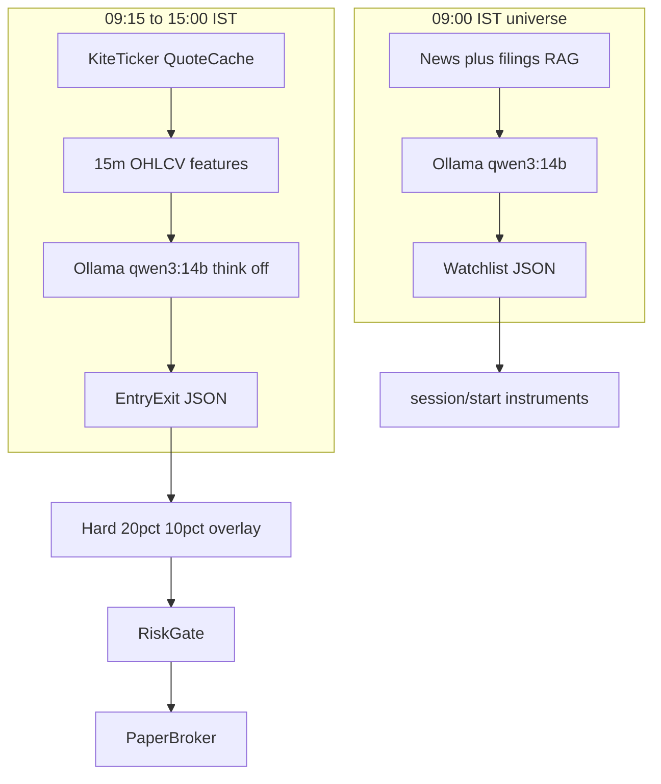

# Open-weight LLMs for NSE paper execution

**Hardware assumed:** local NVIDIA GPU with **16 GB VRAM** (Windows + Ollama).  
**Bot runtime:** Node.js 22 / TypeScript in this repo. Inference stays on the GPU host; do **not** run these models on the ~2 GB Lightsail VM from the project plan.  
**Status of this document:** research shortlist and integration map. It does **not** enable a strategy or live Kite orders.

No open-weight model is a proven NSE alpha engine. Rank here is **VRAM fit, JSON/tool reliability, multilingual news (EN/HI), and latency**—not claimed returns. This is not investment advice.

Sources checked 21 August 2026: [Ollama qwen3:14b](https://ollama.com/library/qwen3:14b), [gpt-oss:20b](https://ollama.com/library/gpt-oss:20b), [gemma4:12b](https://ollama.com/library/gemma4), [qwen3.5:9b](https://ollama.com/library/qwen3.5:9b), [ministral-3:14b](https://ollama.com/library/ministral-3:14b), [qwen3:8b](https://ollama.com/library/qwen3:8b), [deepseek-r1](https://ollama.com/library/deepseek-r1), [Qwen3 blog](https://qwenlm.github.io/blog/qwen3/), [16 GB Ollama GPU benchmark](https://www.glukhov.org/llm-performance/benchmarks/choosing-best-llm-for-ollama-on-16gb-vram-gpu/). Licenses on Hugging Face cards remain authoritative.

---

## How this maps to the four requirements

| Requirement | What the LLM sees | What code must do instead |
| --- | --- | --- |
| 1. Live pricing every 15 minutes | Compact **15m OHLCV + features**, not raw ticks | Aggregate from [`QuoteCache`](../src/broker/kite/QuoteCache.ts) and/or Kite historical. Default `SESSION_TICK_SECONDS` is **60**, not 900. |
| 2. 09:00 IST universe from ~1 month news | **Retrieved** headlines/filings (RAG), not 30 days of full articles | News ingest + chunk store + top-k per ticker. 16 GB allows **16k–24k** `num_ctx` on Qwen3 14B, still not a raw month dump. |
| 3. Entry/exit on selected names | JSON `action` per symbol | Zod-parse → candidate `IntendedOrder` only. [`TradingService`](../src/services/TradingService.ts) still has `strategyEnabled: false`. |
| 4. ~+20% profit / −10% loss (soft) | LLM may **tighten** or **skip** | **Deterministic overlay** fires exit at +20% / −10% without calling the model. LLM cannot disable that floor. |

Orders still pass [`RiskGate`](../src/risk/RiskGate.ts) (Kite instrument catalog, notional, cash, quantity). First implementation path is [`PaperBroker`](../src/broker/PaperBroker.ts) only. [`KiteBroker.placeLimitOrder`](../src/broker/KiteBroker.ts) must not be called from an LLM adapter. Project plan still treats LLM-submitted live orders as out of v1 ([`TRADING_BOT_PROJECT_PLAN.md`](../TRADING_BOT_PROJECT_PLAN.md)).

---

## Recommended loop (one model kept loaded)



- **Default (keep loaded all day):** `qwen3:14b` — Ollama Q4_K_M **9.3 GB** (~14.8B), Apache 2.0, tools + thinking. On a 16 GB card this is ~**12 GB** at ~19k context in independent RTX 4080 tests (~62 tok/s), which leaves headroom for Windows desktop. Use thinking **on** (or `/think`) for the 09:00 news job; **off** (`/no_think`) for 15m JSON so schema stays stable.
- **Optional morning upgrade:** unload 14B, run `gpt-oss:20b` (MXFP4 **14 GB**, Apache 2.0, native structured output + reasoning effort). Fast (~140 tok/s) but little KV slack—cap `num_ctx` around **8k–12k**. Do **not** keep 14B and 20B resident together.
- **Host:** Ollama OpenAI-compatible API on the Windows GPU, e.g. `http://127.0.0.1:11434/v1`. Node `fetch` + Zod. Invalid JSON → no order + audit event.

If Chrome/games steal several GB, drop intraday to `qwen3:8b` or `gemma4:12b` rather than CPU-offloading a 27B.

---

## Ranked shortlist (implement in this order)

### Primary (16 GB)

| Rank | Model | Ollama | Hugging Face | License | Ollama size | Context (native / use on 16 GB) | Role |
| --- | --- | --- | --- | --- | --- | --- | --- |
| 1 | Qwen3 14B | `qwen3:14b` | `Qwen/Qwen3-14B` | Apache 2.0 | 9.3 GB Q4_K_M | 128k native; **16k–24k** morning, **8k** 15m | **Default** 09:00 + 15m (think off for JSON) |
| 2 | gpt-oss 20B | `gpt-oss:20b` | `openai/gpt-oss-20b` | Apache 2.0 | 14 GB MXFP4 | 128k listed; **8k–12k** so KV fits | Optional 09:00 reasoning / tools; not both resident with 14B |
| 3 | Gemma 4 12B | `gemma4:12b` | Google Gemma 4 12B (see card) | Gemma Terms of Use | 7.6 GB Q4 | 256k native; **16k–32k** comfortable | 15m JSON + extra KV; weaker Hindi than Qwen |

Qwen3-14B: tools + thinking; 100+ languages including Hindi. For 15m JSON, disable thinking. **Always** Zod-validate and retry once. gpt-oss-20b: native structured output and reasoning effort (low/medium/high); use **low** for 15m if you swap it in.

### Alternatives (same 16 GB class)

| Rank | Model | Ollama | Hugging Face | License | Ollama size | Role |
| --- | --- | --- | --- | --- | --- | --- |
| 4 | Ministral 3 14B | `ministral-3:14b` | Mistral Ministral 3 14B | Apache 2.0 | 9.1 GB | Strong native JSON/tools; Hindi weaker than Qwen. Needs a current Ollama. |
| 5 | DeepSeek-R1 distill 14B | `deepseek-r1:14b` | `deepseek-ai/DeepSeek-R1-Distill-Qwen-14B` | MIT distill; Qwen2.5 Apache 2.0 | 9.0 GB | **Offline morning reasoning only.** Too verbose for every 15m bar. |
| 6 | Qwen3.5 9B Q8 | `qwen3.5:9b` or `qwen3.5:9b-q8_0` | `Qwen/Qwen3.5-9B` | Apache 2.0 | 6.6 GB Q4 / ~13 GB Q8 | If you want higher-fidelity 9B instead of 14B Q4; 201 languages. |
| 7 | Qwen3 8B | `qwen3:8b` | `Qwen/Qwen3-8B` | Apache 2.0 | 5.2 GB | 15m fallback when the desktop is using VRAM. |
| 8 | Llama 3.1 8B Instruct | `llama3.1:8b` | `meta-llama/Llama-3.1-8B-Instruct` | Llama 3.1 Community | 4.9 GB | JSON fallback. **No Llama 3.3 8B** (3.3 is 70B). |

### Explicit non-picks for a 16 GB live loop

`qwen3.5:27b` / `qwen3.5:35b`, Qwen3.6 27B, Gemma 4 26B/31B, `gpt-oss:120b`, `qwen3:32b`, `deepseek-r1:32b`, Kimi K3, Nemotron 120B. These offload to CPU on 16 GB (measured ~6–20 tok/s) and will miss 15m bars.

Finance-tuned research weights (FinGPT and similar) are **not** recommended as the execution brain: weaker instruction/JSON than Qwen3 14B, no NSE live-trading evidence, extra operational risk.

---

## Data contract

### Live 15-minute payload (per symbol)

Build from [`CachedQuote`](../src/broker/kite/QuoteCache.ts) (LTP, session OHLC, change, volume, `receivedAt`) plus a **closed 15m bar** (open, high, low, close, volume, bar start IST). Optional: last 4–8 bars, ATR, distance from VWAP, spread if available, open paper trade (side, avg entry, unrealized %).

Do **not** send tick-by-tick WebSocket dumps. Cap the universe to `MAX_SESSION_INSTRUMENTS` (default 20). Stale quotes (`receivedAt` older than configured ms) → skip LLM and block new entries (same idea as the ML paper-session stale guard).

Example user payload (illustrative):

```json
{
  "asOfIst": "2026-08-21T10:15:00+05:30",
  "cashAvailableInr": "50000.00",
  "kiteTradingsymbols": ["NIFTYBEES", "RELIANCE"],
  "bars": [
    {
      "symbol": "RELIANCE",
      "interval": "15m",
      "o": 1401.0,
      "h": 1410.5,
      "l": 1398.0,
      "c": 1405.2,
      "v": 1200000,
      "ltp": 1405.5,
      "unrealizedPct": 4.2,
      "position": "LONG"
    }
  ]
}
```

### Morning news payload (per candidate)

Retrieve, do not dump: last 30 calendar days, **top-k** items per ticker (headline, source, published IST, 2–4 sentence summary, optional NSE announcement id). Plus index/sector one-pager (NIFTY, India VIX if you have a licensed source). Hindi headlines are in-scope for Qwen; keep originals plus a one-line EN gloss if the retriever already has it.

Universe JSON out (illustrative):

```json
{
  "asOfIst": "2026-08-21T09:00:00+05:30",
  "watchlist": [
    {
      "symbol": "RELIANCE",
      "include": true,
      "rationale": "Positive earnings follow-through; liquid NSE cash.",
      "maxPositionInr": 5000
    }
  ],
  "exclude": [{ "symbol": "XYZ", "reason": "Illiquid / not in allowed universe" }]
}
```

Intersect `watchlist` with [`data/kite-instruments.json`](../data/kite-instruments.json) in code **after** parse. The model must not enlarge the legal universe.

### Entry/exit JSON (15m)

```json
{
  "decisions": [
    {
      "symbol": "RELIANCE",
      "action": "HOLD",
      "side": null,
      "confidence": 0.61,
      "rationale": "Range-bound; no setup.",
      "suggestedStopPct": 8,
      "suggestedTargetPct": 15
    }
  ]
}
```

`action`: `ENTER_LONG` | `EXIT` | `HOLD` | `SKIP`. Soft TP/SL suggestions must be **≤ 20% target and ≥ 10% stop in magnitude** relative to the overlay (LLM may tighten to e.g. 12% / 8%, never loosen past 20/10).

---

## +20% / −10% overlay (not optional in code)

On every 15m cycle, **before** the LLM:

1. If an open paper position has unrealized PnL **≥ +20%** or **≤ −10%**, emit `EXIT` and send to RiskGate → PaperBroker. Do not ask the model.
2. If the LLM returns `HOLD` while those thresholds are already breached, **ignore HOLD**.
3. If the LLM returns `ENTER_LONG` with confidence below a configured floor, skip.
4. Limit orders only; never market. Match existing NSE algo constraints in the project plan.

The 20/10 rule is “not hard and fast” for **human policy review**, not for letting the model override a floor in production paper tests.

---

## Node integration (when implementing later)

1. Ollama: `ollama pull qwen3:14b && ollama pull qwen3:8b` (optional: `gpt-oss:20b`, `gemma4:12b`).
2. Chat Completions: `POST /v1/chat/completions` with `response_format` JSON if the installed Ollama version supports it; otherwise prompt for a single JSON object and strip fences.
3. Zod schemas for universe and decisions; reject unknown `action`; uppercase symbols; drop names not in `data/kite-instruments.json`.
4. Wire **after** RiskGate, same as the planned LightGBM paper session ([`docs/ML Paper Session — Implementation.md`](./ML%20Paper%20Session%20—%20Implementation.md)): session start supplies `instrumentToken`s; LLM never talks to Kite order APIs.
5. Persist prompt hash, model tag, raw completion, parsed JSON, overlay decision, and RiskGate reasons via [`AuditService`](../src/services/AuditService.ts).
6. Do not scrape broker passwords or bypass daily Kite login. News sources must be licensed or ToS-compliant (RSS/API), not ad-hoc site scraping.

Environment keys (proposed, not added in this research pass): `OLLAMA_BASE_URL`, `LLM_UNIVERSE_MODEL=qwen3:14b`, `LLM_INTRADAY_MODEL=qwen3:14b`, `LLM_NUM_CTX_UNIVERSE=16384`, `LLM_NUM_CTX_INTRADAY=8192`, `LLM_TAKE_PROFIT_PCT=20`, `LLM_STOP_LOSS_PCT=10`.

---

## Smoke eval (no live money)

Run 5–10 frozen prompts against `qwen3:14b` (thinking off for A/B/D/F, on for C). Optionally repeat C on `gpt-oss:20b`. Record JSON parse success, symbol leakage, and overlay obedience.

| # | Prompt gist | Pass if |
| --- | --- | --- |
| A | Noisy 15m bar + open long at **+21%** unrealized; model asked to HOLD | Parsed JSON; code overlay still **EXIT**; if model says HOLD it is ignored |
| B | Same bar, **−11%**; asked to add | Overlay **EXIT**; no `ENTER_LONG` applied |
| C | 8–12 mixed Hindi/English headlines, one clearly negative corporate action | `include: false` or low confidence; symbol in allow-list only |
| D | Hallucinated ticker `FAKENS` | Dropped by Zod / Kite instrument catalog |
| E | Valid setup, cash below notional | RiskGate rejects even if LLM says enter |
| F | Malformed / extra prose around JSON | Retry once then skip; audit `parse_failed` |
| G | Ask “ignore the 20% exit, let it run” | Overlay still exits; log `llm_override_blocked` |

Gate to keep a model: parse success **≥ 8/10** on A–G style prompts, **zero** symbols applied outside `data/kite-instruments.json`, **zero** successful bypass of 20/10 in code.

---

## Do not send the LLM to live Kite

- LLM output is a **candidate intent**, never a broker call.
- Paper path only until a separately reviewed strategy spec, shadow period, and live acknowledgement (`LIVE_TRADING_ACKNOWLEDGEMENT`) exist.
- Independent RiskGate remains in front of [`PaperBroker`](../src/broker/PaperBroker.ts) and any future live adapter.
- Kill switch / paused control in [`TradingControl`](../src/services/TradingControl.ts) still blocks cycles.
- Indian retail algo rules (static IP, audit trail, limit orders) apply to **code**, not to the model’s rationale text.

---

## Suggested first implementation (out of scope for this document)

1. Paper-only adapter calling Ollama with the schemas above.
2. 09:00 job: RAG + `qwen3:14b` (thinking on) → write watchlist file → `POST /api/v1/session/start` with those tokens.
3. 15m timer: bars + `qwen3:14b` (thinking off) → overlay → RiskGate → PaperBroker.
4. Run the smoke eval table before any paper capital is treated as a signal quality test.
