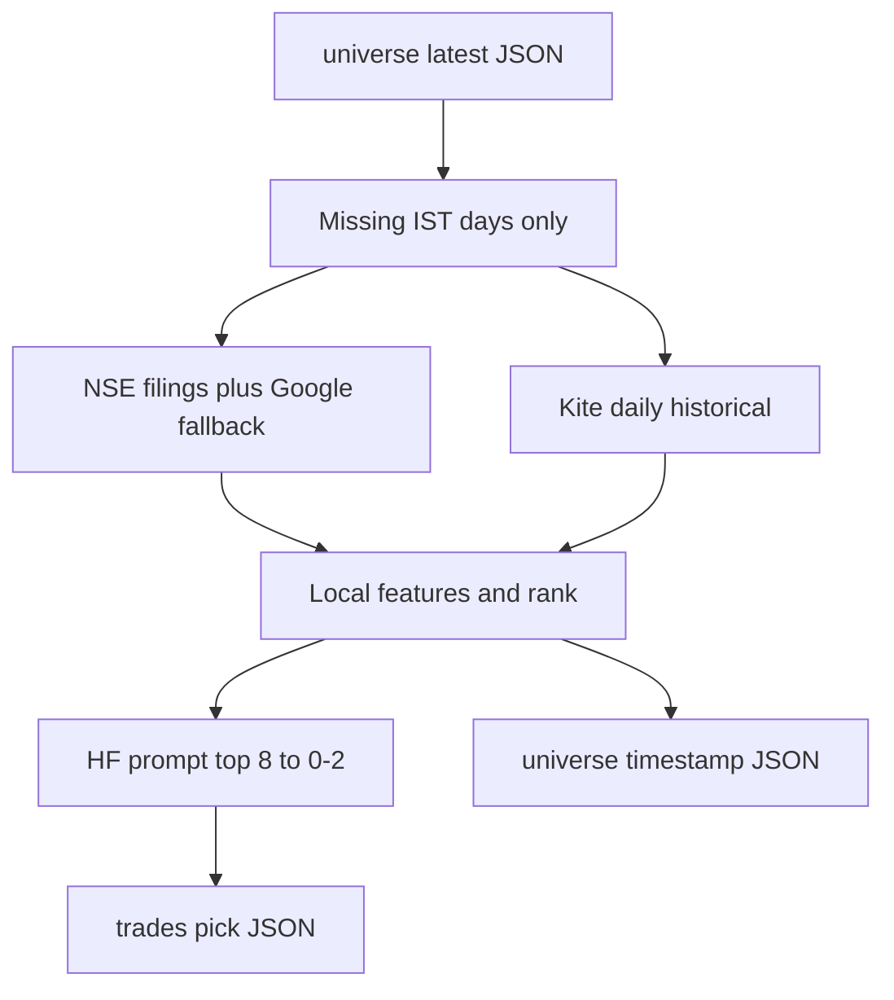

# Superior universe selection (at most 2 names)

## Objective

Replace the current news-only, up-to-12-name LLM pick with a **desk-standard cash-equity process**: liquid catalog names, **event quality + price/volume structure + relative strength**, incremental research stored under `universe/`, and a precise prompt that may return **0, 1, or 2** includes (never force a weak pair). Still **no live orders**.

After plan approval: `CreateGoal` once, then implement and verify against the repo.

## Why the current pick is weak

[`suggestUniverse`](src/llm/LlmTradeAdvisorService.ts) fetches a full 30-day news dump every time, prompts on filings only ([`buildUniverseMessages`](src/llm/prompts.ts)), and writes a long watchlist under [`trades/`](src/llm/decisionStore.ts) (see [trades/2026-08-22T06-40-36-420Z.json](trades/2026-08-22T06-40-36-420Z.json) — many “MERGER” names that are **holding-company filings**, not tradeable setups). There is **no Kite historical**, no candle/features, no incremental lookback.

## Selection strategy (what “highest market standard” means here)

This is a **low-frequency NSE cash** book, not HFT. The standard stack is:

1. **Hard universe** — existing Kite catalog (~Nifty 50 + ETFs) only.
2. **Liquidity / tradability** — skip names with dead volume vs 20-day average (from Kite daily bars).
3. **Structure** — computed in TypeScript, not “chart screenshots”: SMA20 vs SMA50, distance from 20-day high, ATR%, up-volume vs 20-day volume.
4. **Relative strength** — 20-day return minus `NIFTYBEES` (already in catalog) as the index proxy.
5. **Event overlay** — existing NSE corporate announcements (Google RSS fallback), scored with current `FilingKind` (`RESULT`, `BUYBACK`, `DEFAULT`, …). Down-weight generic “incorporation / holding company” merger noise.
6. **Rank locally, then LLM** — code produces a short **candidate table** (top ~8). The model only **confirms 0–2** with a cited rationale. That is how professional desks use models: they do not let the LLM invent a 12-name merger list.

Do **not** add Moneycontrol/TradingView scrapers. Optional later vendor: licensed news API. v1 sources stay **Kite + NSE + Google RSS**.

## Incremental `universe/` store

New folder [`universe/`](universe/) (gitkeep + `.gitignore` if files are large). Daily knowledge file, e.g. `universe/2026-08-22.json`:

- `coverageFrom` / `coverageTo` (IST calendar dates)
- `asOfIst`, catalog version/path
- Per symbol: new filings that day, last ~20 compact daily bars, feature snapshot

On each `POST /api/v1/llm/universe`:

1. Scan `universe/*.json`, take latest `coverageTo`.
2. If none: fetch **30 calendar days** (current behaviour, once).
3. If latest is today: **reuse** stored knowledge; do not re-hit NSE/Kite for the window.
4. Else fetch **only** `(coverageTo+1) … today` (NSE `from_date`/`to_date` already exist in [`NewsService.fetchNseAnnouncements`](src/news/NewsService.ts); add a range API instead of always `lookbackDays`).
5. Merge into a new timestamped file (keep history; do not overwrite the previous day).

Market holidays: empty bars/filings for that date still advance `coverageTo` so we do not refetch forever.

## Kite market data (new)

[`KiteBroker`](src/broker/KiteBroker.ts) has **no historical method**. Add a thin `getDailyCandles(instrumentToken, from, to)` using official `kiteconnect` `historicalData` (`interval: 'day'`). Rate-limit (~3/s). Use for the **gap days plus enough lookback to compute 20/50 SMA** (on first run pull 60 calendar days of bars once; later only missing days + keep rolling window in JSON).

15-minute session logs stay for **intraday BUY/HOLD/EXIT**, not for 09:00 ranking (too noisy / incomplete before the open).

## Prompt and schema

Rewrite [`buildUniverseMessages`](src/llm/prompts.ts):

- Input: `allowed` = locally ranked top 8 with compact features + 1–2 material filings each (keep token budget).
- System: pick **at most 2** `include: true`; omit the rest; **zero is valid** if nothing has structure + a real catalyst; no live orders; `/no_think`.
- [`universeSuggestionSchema`](src/llm/schemas.ts): after parse, **code clamps** to max 2 includes (highest confidence / first two `include: true` after catalog intersect). Rank field optional (`rank: 1|2`).

[`writeUniverseFile`](src/llm/decisionStore.ts) keeps writing the **pick** under `trades/` (session/start payload). **Knowledge** goes to `universe/` via a new writer. Config: `UNIVERSE_DIR=universe`.

## Tests

- Incremental gap: latest coverage yesterday → fetch range is 1 day, not 30.
- Feature rank prefers higher RS + material `RESULT` over empty `OTHER`.
- Prompt/schema: more than 2 includes truncated to 2; 0 includes allowed.
- Historical client mocked; no `placeLimitOrder`.

## Out of scope

Live Kite orders, TradingView/Moneycontrol APIs, forcing exactly two names.
